# 🇮🇹 Pokémon Infinite Fusion — Versione Italiana

<p align="left">
  <a href="https://github.com/orach977/infinitefusion-italian-version/releases"></a>
  
  
  
</p>

> Fork italiano di [Pokémon Infinite Fusion](https://github.com/infinitefusion/infinitefusion-e18) con localizzazione completa, strumenti esclusivi e upscaling grafico.

<p align="center">
  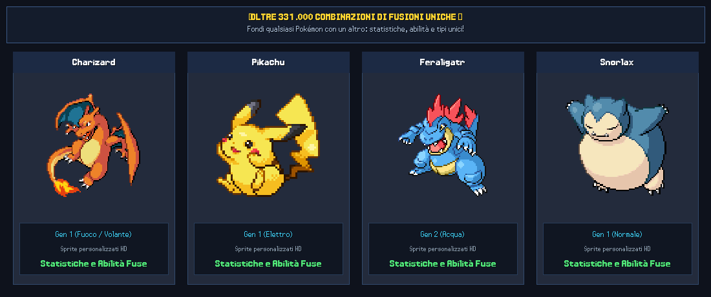
</p>

---

## 📋 Sommario

- [Cos'è questo progetto](#-cosè-questo-progetto)
- [Confronto: Vanilla vs Questa Versione (Tutte le Novità)](#️-confronto-vanilla-vs-questa-versione-tutte-le-novità)
- [Traduzione Italiana — Dialoghi e Mosse](#-traduzione-italiana--dialoghi-e-mosse)
- [Requisiti](#-requisiti)
- [Installazione da zero](#-installazione-da-zero)
- [Aggiornamento](#-aggiornamento)
- [Come giocare](#-come-giocare)
- [Radar Habitat — Guida completa](#-radar-habitat--guida-completa)
- [Incontri a vista nell'Overworld](#-incontri-a-vista-nelloverworld)
- [Pokédex HTML offline](#-pokédex-html-offline)
- [Remaster grafico con Magpie](#-remaster-grafico-con-magpie)
- [Randomizer integrato](#-randomizer-integrato)
- [Struttura del progetto](#-struttura-del-progetto)
- [Domande frequenti (FAQ)](#-domande-frequenti-faq)
- [Crediti](#-crediti)
- [Disclaimer](#-disclaimer)

---

## 🎮 Cos'è questo progetto

Pokémon Infinite Fusion è un fan game gratuito basato su RPG Maker XP che permette di **fondere qualsiasi coppia di Pokémon** tra le generazioni 1-7+ (**576 Pokémon base**, per oltre **331.000 combinazioni di fusioni possibili**!).

Questa versione (a cura di **@orach977**) arricchisce l'esperienza originale introducendo la traduzione integrale in italiano, un Radar Habitat ridisegnato con ciclo giorno/notte e filtri dinamici, il visualizzatore di IV/EV e Natura nel riepilogo, indicatori di efficacia mosse in battaglia, anteprima avanzata a doppio esito per le fusioni DNA, remaster grafico GPU con Magpie e un sistema di installazione/aggiornamento one-click.

---

## ⚖️ Confronto: Vanilla vs Questa Versione (Tutte le Novità)

Per garantire la massima trasparenza verso giocatori e appassionati, la seguente guida illustra in dettaglio **cosa era già presente nel gioco base originale (Vanilla)** e **cosa è stato sviluppato, introdotto o riscritto da zero da me (@orach977)** in questo fork italiano.

### 📊 Tabella di Confronto Rapido

| Caratteristica / Funzione | 🎮 Versione Vanilla (Originale) | 🇮🇹 Questa Versione (@orach977) | Descrizione e Dettagli |
|---|:---:|:---:|---|
| **Lingua del Gioco** | Solo Inglese | 🟢 **100% Italiano** | Tradotti oltre 30.000 testi: dialoghi della trama, PNG, capipalestra, mosse, abilità, strumenti, bacche, MT, menu e Pokédex |
| **Radar Habitat In-Game** | ❌ Assente | 🟢 **Sviluppato da zero (UI Dark Glass)** | Strumento nel menu di pausa: Pokémon per zona, orologio in-game, ciclo Giorno/Notte/Mattina, 5 filtri dinamici [Z], percentuali, statistiche base, GPS tracker e ricerca globale |
| **Efficacia Mosse in Battaglia** | ❌ Assente | 🟢 **Integrata in tempo reale** | Durante la lotta, ogni mossa mostra un badge calcolato in tempo reale contro il tipo avversario (*Superefficace x2/x4, Efficace, Poco eff., Immune*) |
| **Visualizzatore IV, EV e Natura** | ❌ Nascosti / Non consultabili | 🟢 **Integrato nel Riepilogo** | Tasto Azione [Z] nella Pagina Competenze del Pokémon per visualizzare IV (0-31), EV (0-252/510) e modificatori positivi/negativi della Natura |
| **Anteprima Fusione DNA Avanzata** | ⚠️ Scheda base essenziale | 🟢 **Confronto a 2 Colonne Completo** | Anteprima a doppio esito (A+B vs B+A), calcolo BST, ruoli Testa/Corpo, abilità trasmissibili, statistiche base e badge ★ Custom Sprite |
| **Incontri a Vista (Overworld Encounters)** | ⚠️ Bloccati a Kanto (Solo Hoenn) | 🟢 **Sbloccati per l'intero gioco** | I Pokémon selvatici compaiono e si muovono fisicamente sulla mappa (erba, grotte, acqua) con comportamenti dinamici, Shiny visibili a vista con scintille e toggle On/Off nelle Opzioni |
| **Pokédex Web Offline** | ❌ Assente | 🟢 **Incluso (`pokedex.html`)** | Pokédex interattivo standalone per browser senza connessione internet; include tutti i 576 Pokémon base con statistiche, tipi e filtri habitat |
| **Remaster Grafico GPU (Magpie)** | ❌ Assente (Solo scaling pixel nativo) | 🟢 **Preconfigurato con 7 Profili** | Launcher `Avvia_Con_Remaster.bat` con Magpie DirectX 11 / HLSL (xBRZ 4x, MMPX, CAS) e risoluzione nativa 1x forzata all'avvio |
| **Installatore & Auto-Update 1-Click** | ⚠️ Download manuale / Rischio conflitti | 🟢 **Script Automatico (`INSTALL_OR_UPDATE.bat`)** | Con Git embedded portatile: scarica, aggiorna o sincronizza il gioco con un click mantenendo sempre intatti i salvataggi in `%APPDATA%` |
| **Correzioni di Stabilità RGSS** | ⚠️ Crash noti (`printf`, apostrofi) | 🟢 **Risolti e Ottimizzati** | Risolti crash di formattazione stringhe con caratteri accentati/apostrofi, rendering tipografico ottimizzato con font autentico Power Green |
| **Numero Pokémon Base** | 576 Pokémon (Gen 1-7+) | 576 Pokémon (Gen 1-7+) | *Nativo Vanilla*: fedele al roster originale ufficiale di Infinite Fusion |
| **Combinazioni di Fusione** | Oltre 331.000 fusioni + Triple fusioni | Oltre 331.000 fusioni + Triple fusioni | *Nativo Vanilla*: motore di fusione originale preservato e potenziato con le nuove interfacce |
| **Regioni e Mappe** | Kanto, Johto, Isole Sevii | Kanto, Johto, Isole Sevii | *Nativo Vanilla*: tutte le aree, città, percorsi ed eventi narrativi originali fruibili al 100% in italiano |
| **Randomizer & Modalità Sfida** | Integrato nel gioco | Sincronizzato con il Radar Habitat | *Nativo Vanilla*: il nostro Radar Habitat legge in tempo reale le tabelle del randomizer se attivo |

---

### 🎮 Cosa era già presente nel gioco Vanilla (Base Originale)
Le seguenti funzionalità appartengono al geniale lavoro del team originale di **Pokémon Infinite Fusion** (guidato da *Schrrrup* e dalla community internazionale):
1. **Motore Algoritmico delle Fusioni**: il sistema che combina qualsiasi coppia di Pokémon calcolandone tipi, statistiche, abilità e sprite ibridi.
2. **Sprite Personalizzati della Community**: decine di migliaia di sprite realizzati a mano dagli artisti della community internazionale, affiancati dal generatore automatico.
3. **Mappe e Trama Originale**: la campagna completa ambientata a Kanto e Johto, con l'inclusione delle Isole Sevii, missioni dei capipalestra, boss del Team Rocket e post-game.
4. **Triple Fusioni**: gli speciali eventi di fusione a tre per i Pokémon leggendari (es. Zapmolcuno).
5. **Modalità Native di Gioco**: la modalità Classica, la modalità Personalizzata con Randomizer nativo e le regole Nuzlocke opzionali integrate nell'engine.

---

### ⭐ Cosa ho sviluppato e introdotto io (@orach977)
Tutto ciò che segue è stato **interamente progettato, programmato, tradotto o integrato in questo fork**:

1. **Localizzazione Italiana Integrale (30.000+ testi)**:
   - Traduzione completa di tutti i dialoghi della storia, conversazioni PNG, capipalestra, Superquattro e missioni secondarie (`Data/italian.dat`).
   - Traduzione ufficiale italiana di tutti i nomi delle mosse, abilità, strumenti, bacche, MT e messaggi di stato in battaglia.
   - Voci del Pokédex interamente tradotte in italiano.
2. **Radar Habitat In-Game Ridisegnato (Dark Glass UI + Ciclo Giorno/Notte)**:
   - Nuovo script nativo in Ruby/RGSS (`Data/Scripts/052_InfiniteFusion/Menus/HabitatRadar.rb`) accessibile dal menu di pausa.
   - Interfaccia elegante **Dark Glass (512×384)** a tema scuro senza sovrapposizioni o difetti grafici.
   - **Riconoscimento del Tempo e Ciclo Giornaliero**: orologio in tempo reale nell'header con indicatore di periodo (`MATTINA 🌅`, `GIORNO ☀️`, `NOTTE 🌙`).
   - **5 Filtri Dinamici con tasto [Z]**: naviga istantaneamente tra *Tutti, Giorno, Notte, Mattina, Attivi Ora*.
   - **Card Pokémon Ottimizzate**: icona Poké Ball per i catturati, dot a pixel indicante se il Pokémon è reperibile nell'orario corrente, metodo di cattura e intervallo di livello.
   - **Pannello Dettagli Approfondito**: battler ad alta fedeltà, badge tipo impilati senza collisioni, tag disponibilità oraria, elenco di tutti i metodi di incontro per la zona, 6 statistiche base con barre grafiche proporzionali colorate e BST totale.
   - **Tracciatore GPS e Ricerca Globale**: imposta un bersaglio da monitorare per ricevere un alert sonoro/visivo quando appare nell'erba, oppure cerca per nome (`[C]` o `[S]`) in quale mappa si nasconde qualsiasi Pokémon.
3. **Indicatori di Efficacia Mosse in Tempo Reale nel Fight Menu**:
   - Menu di combattimento ridisegnato: analizza la combinazione di tipi del Pokémon avversario attivo e applica badge dinamici colorati su ogni mossa (*Superefficace x2 / x4, Efficace x1, Poco efficace x0.5 / x0.25, Immune x0*).
4. **Visualizzatore IV, EV e Natura nel Riepilogo**:
   - Modifica al menu `UI_Summary`: premendo il tasto Azione **[Z]** nella schermata delle statistiche (Pagina 3 Competenze), visualizza i valori individuali esatti (IV 0-31), i punti allenamento (EV 0-252 su 510) e i modificatori della Natura (+10% in verde / -10% in rosso).
5. **Anteprima Fusione DNA a Doppio Esito & Scheda Dettagli a Due Colonne**:
   - Anteprima simultanea che mette a confronto entrambe le varianti (Testa A + Corpo B vs Testa B + Corpo A) con tipi risultanti e totale statistiche (BST).
   - Scheda Dettagli espansa premendo **Z** o **Shift**: visualizzazione pulita su due colonne affiancate senza testo compresso o sovrapposto, con ruoli anatomici, statistiche base complete, abilità selezionabili e badge per sprite personalizzati (**★ Custom Sprite**).
6. **Remaster Grafico GPU con Magpie (7 Profili Shader HLSL)**:
   - Integrazione completa del motore Magpie con avvio one-click (`Avvia_Con_Remaster.bat`).
   - Forzatura automatica della finestra di gioco a 1x nativo (dimensione schermo M, 512×384) per evitare pre-scaling difettoso dell'engine RGSS prima del passaggio alla GPU.
   - 7 profili personalizzati creati e ottimizzati per Infinite Fusion: *xBRZ 4x Ultra-HD Smooth, Pixel Art Next-Level RTX (MMPX + CAS), Anime HD, CRT Vintage, ecc.*
7. **Pokédex Web Standalone Offline (`pokedex.html`)**:
   - Applicazione web HTML5/JS reattiva per consultare offline tutti i 576 Pokémon base, con ricerca istantanea, statistiche base, filtri habitat e sincronizzazione.
8. **Script di Installazione e Aggiornamento 1-Click con Git Portatile**:
   - `INSTALL_OR_UPDATE.bat` include una versione portatile e autonoma di Git in `REQUIRED_BY_INSTALLER_UPDATER/`, consentendo l'installazione e gli aggiornamenti con un click a chiunque senza installare software di terze parti.
   - Protezione nativa dei dati di salvataggio memorizzati nella cartella di sistema `%APPDATA%\infinitefusion`.
9. **Fix Architetturali dell'Engine RGSS**:
   - Correzione dei crash dell'interprete Ruby su stringhe italiane contenenti simboli `%` o apostrofi speciali.
   - Ripristino e allineamento dei font authentic (`Power Green`), eliminando caratteri mancanti o quadrati bianchi `[]`.
10. **Incontri a Vista nell'Overworld (Overworld Encounters sbloccati)**:
    - Sbloccato e ottimizzato il motore di spawn a vista per l'intero gioco (Kanto, Johto e Hoenn), superando il vecchio blocco della versione vanilla.
    - I Pokémon selvatici appaiono e si muovono fisicamente su percorsi, caverne e superfici d'acqua con comportamenti specifici (curiosi, aggressivi, fuggiaschi o statici).
    - **Shiny a vista**: i Pokémon cromatici brillano con animazione e segnale acustico prima ancora di iniziare la lotta.
    - **Reazione al Repellente**: usando un Repellente i Pokémon selvatici fuggono alla vista del giocatore.
    - **Opzione Toggle In-Game**: voce *"Overworld Encounters"* sempre disponibile nelle **Opzioni di Gioco** (`On` / `Off`), abilitata di default e con salvataggio persistente dello stato.

---

## 🇮🇹 Traduzione Italiana — Dialoghi e Mosse

Questa versione include la localizzazione completa in italiano di ogni aspetto dell'avventura:

### ⚔️ Battaglie, Mosse e Tipi in Italiano
Tutti i nomi delle mosse, i tipi di appartenenza, i valori di PP e i messaggi in battaglia sono tradotti:

<p align="center">
  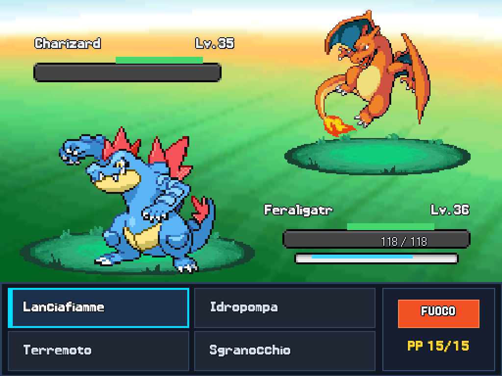
</p>

### 💬 Dialoghi, Trama, Capipalestra e Missioni
Tutti i testi di gioco sono localizzati in italiano: dialoghi narrativi della storia, lore e curiosità di Kanto e Johto, targhe e battaglie dei capipalestra, attivazione e ricompense delle missioni secondarie negli hotel:

#### 🏛️ Capipalestra e Palestre Pokémon
<p align="center">
  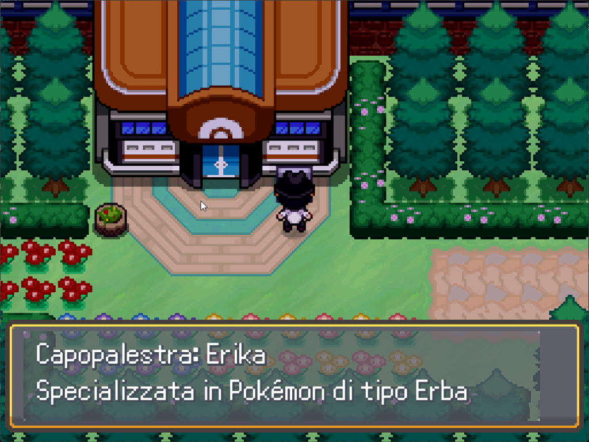
  &nbsp;
  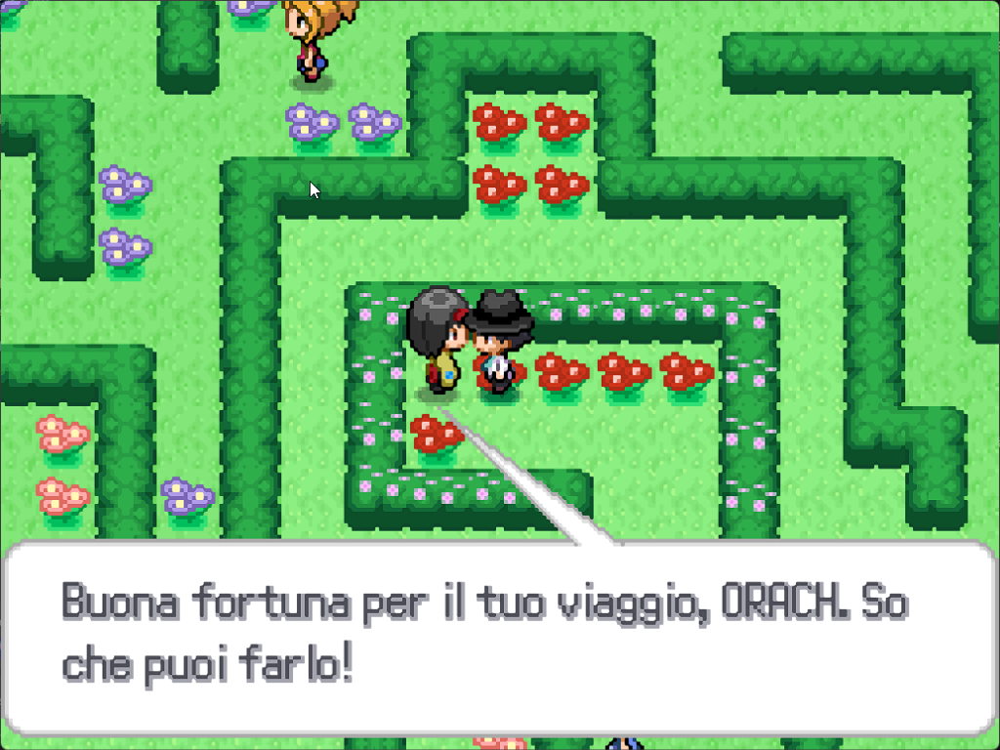
</p>

#### 📜 Missioni Secondarie e Ricompense
<p align="center">
  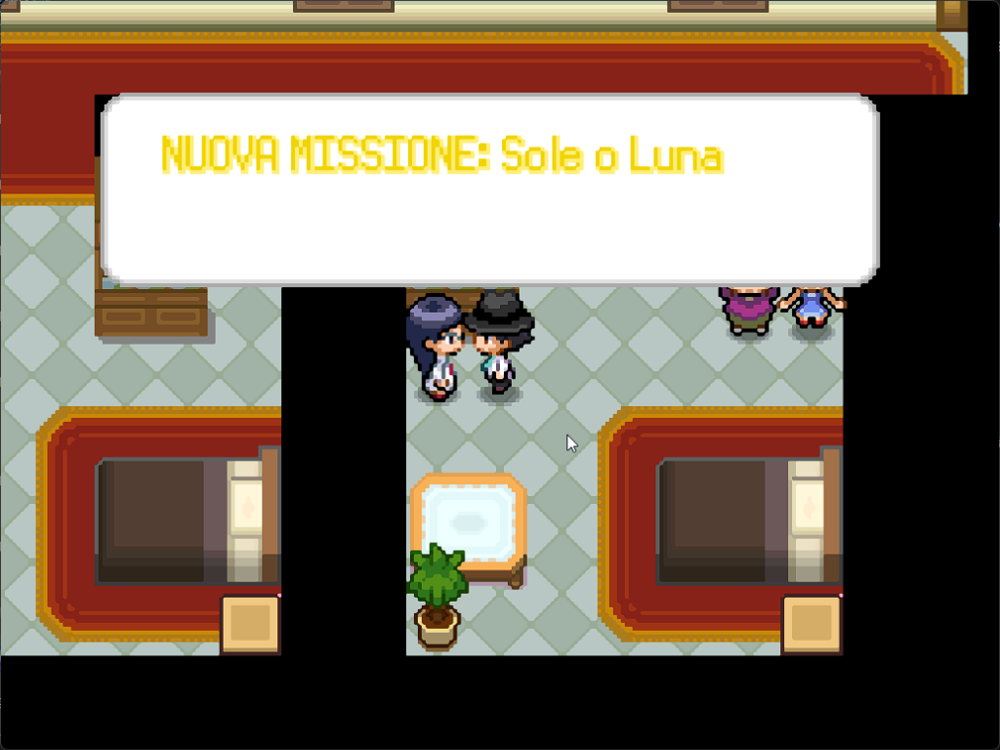
  &nbsp;
  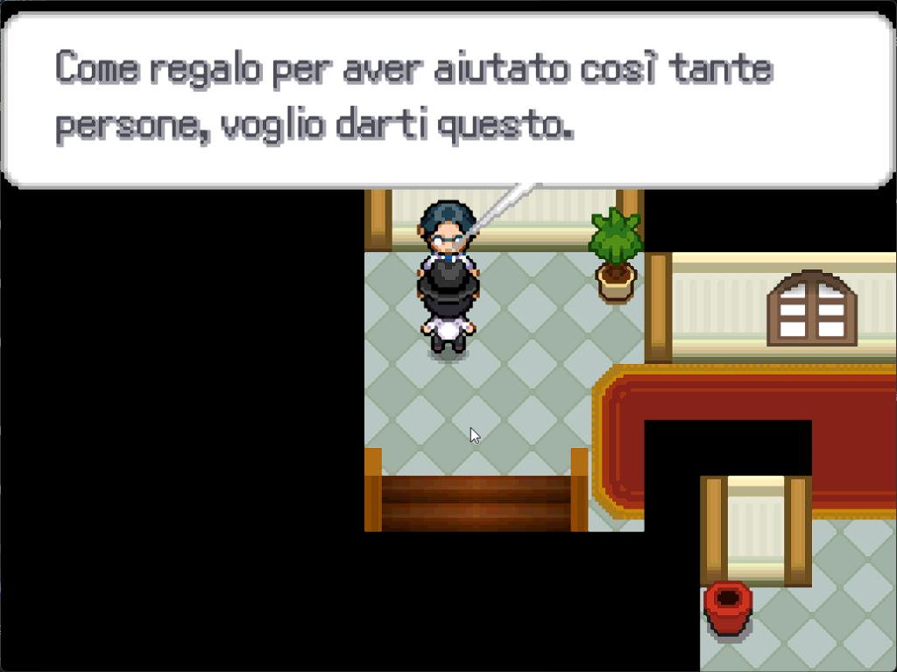
</p>

#### 📖 Trama Principale e Lore del Mondo di Gioco
<p align="center">
  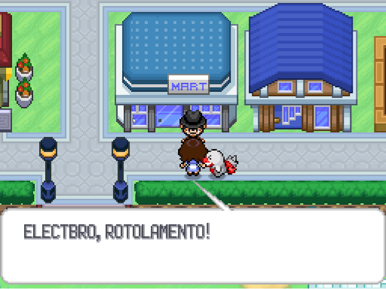
  &nbsp;
  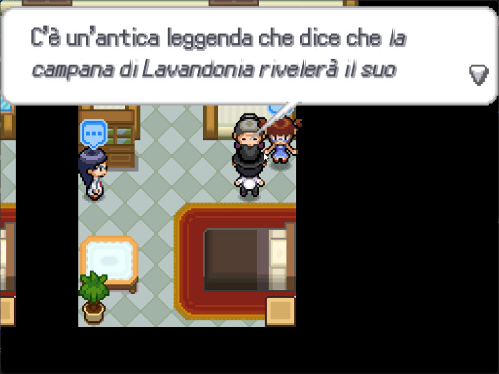
</p>

### 📖 Pokédex In-Game Tradotto
Le voci del Pokédex con descrizioni originali e curiosità tradotte in italiano:

<p align="center">
  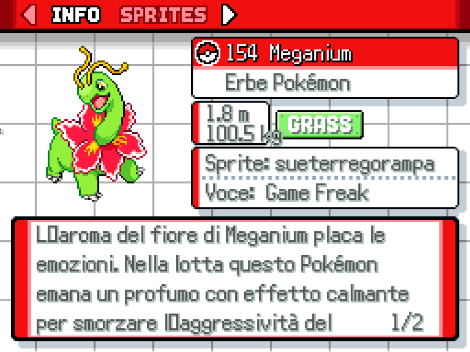
</p>

### 🎒 Borsa e Strumenti in Italiano
Tutti gli strumenti, rimedi, bacche e relative descrizioni degli effetti sono completamente tradotti in italiano ufficiale:

<p align="center">
  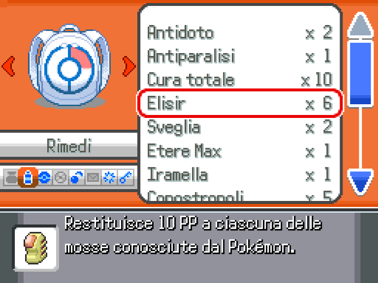
  &nbsp;
  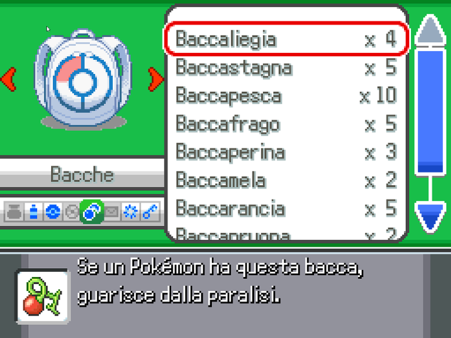
</p>

### 🧬 Anteprima Fusione DNA Dettagliata
Durante la fusione (o consultando l'anteprima con *Super giunzioni*), confronta visivamente i due possibili esiti di fusione con tipi, statistiche totali (BST) e badge degli sprite. Premendo **Z** o **Shift**, apri istantaneamente la **Scheda Dettagli** approfondita con ruoli testa/corpo, statistiche base e abilità trasmissibili:

<p align="center">
  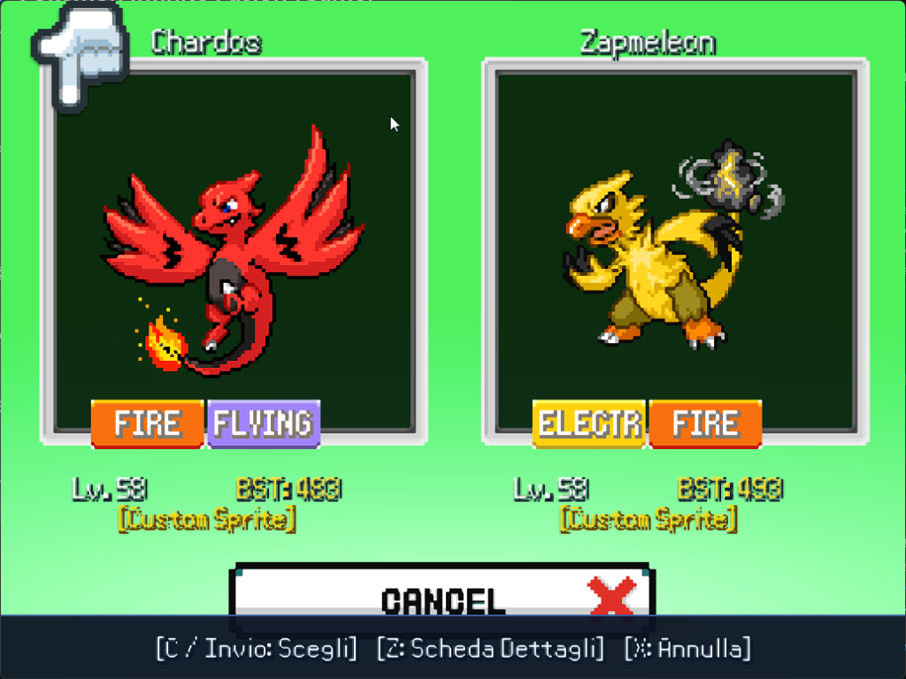
  &nbsp;
  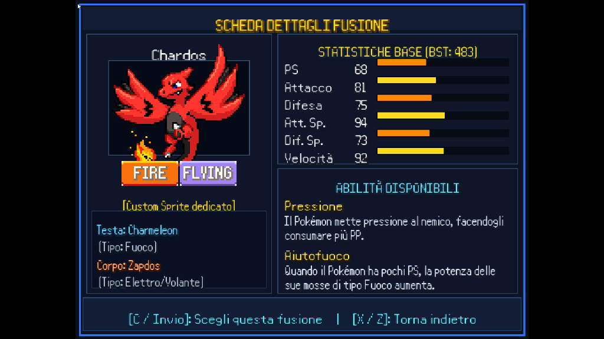
</p>

### 📊 Visualizzatore IV, EV e Natura
Nella schermata delle statistiche di qualsiasi Pokémon del team (Pagina 3 del riepilogo "Competenze"), premi **Z** o il tasto Azione per svelare istantaneamente i Valori Individuali (IV 0-31), il conteggio dei Punti Allenamento (EV 0-252 su totale 510) e i modificatori della Natura (+/-):

<p align="center">
  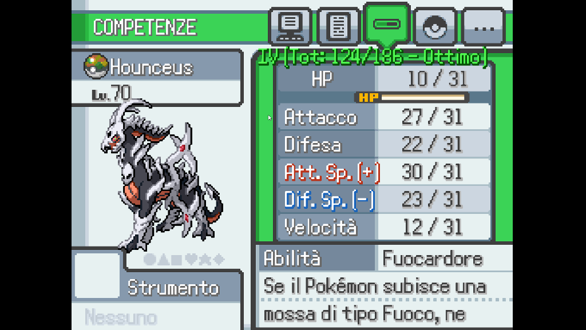
  &nbsp;
  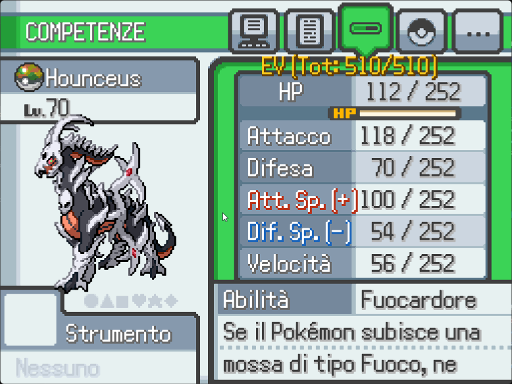
</p>

---

## 💻 Requisiti

- **Sistema operativo**: Windows 10 / 11 (64-bit)
- **Spazio su disco**: ~1 GB
- **RAM**: 4 GB minimo
- **Per il Remaster grafico**: GPU con supporto DirectX 11 (qualsiasi GPU discreta degli ultimi 10 anni)

---

## 📥 Installazione da zero

### Metodo 1 — Clone da GitHub (consigliato)

1. **Scarica e installa Git** da [git-scm.com](https://git-scm.com/) se non lo hai già

2. **Apri il Terminale / PowerShell** e naviga dove vuoi installare il gioco:
   ```powershell
   cd "$HOME\Desktop"
   ```

3. **Clona il repository**:
   ```powershell
   git clone https://github.com/orach977/infinitefusion-italian-version.git InfiniteFusion
   ```

4. **Avvia il gioco**:
   - Apri la cartella `InfiniteFusion`
   - Fai doppio click su **`Game.exe`** per giocare normalmente
   - Oppure usa **`Avvia_Con_Remaster.bat`** per giocare con la grafica upscalata

### Metodo 2 — Download ZIP

1. Clicca il pulsante verde **"Code"** in alto a destra in questa pagina
2. Seleziona **"Download ZIP"**
3. Estrai lo ZIP in una cartella chiamata esattamente `InfiniteFusion`
4. Avvia con `Game.exe` oppure `Avvia_Con_Remaster.bat`

---

## 🔄 Aggiornamento

Se hai già il gioco installato tramite Git:

```powershell
cd "$HOME\Desktop\InfiniteFusion"
git pull origin main
```

I tuoi salvataggi **non verranno toccati**: sono salvati separatamente in:
```
%APPDATA%\infinitefusion
```

---

## 🕹️ Come giocare

### Avvio standard
Fai doppio click su **`Game.exe`**. Il gioco si aprirà in una finestra.

### Avvio con Remaster grafico
Fai doppio click su **`Avvia_Con_Remaster.bat`**:
1. Il launcher avvia automaticamente **Magpie** (incluso nella cartella del gioco)
2. Poi avvia **Game.exe**
3. Premi **ALT + F11** con la finestra del gioco attiva per attivare l'upscaling fullscreen
4. Premi **ALT + F11** o **ESC** per tornare alla finestra normale

> ⚠️ Per il remaster, imposta le dimensioni schermo nel gioco su **M (1x)** o **XL (2x)**, **non** su "Full".

### Comandi di gioco
| Tasto | Azione |
|---|---|
| **Frecce** | Movimento / Navigazione menù |
| **Z / Invio** | Conferma / Interagisci |
| **X / Esc** | Annulla / Apri menù |
| **C** | Azione speciale / Registra oggetto |
| **F5** | Toggle Fullscreen (nativo) |

---

## 📡 Radar Habitat — Guida completa

Il **Radar Habitat** è uno strumento esclusivo di questa versione, accessibile dal **menù di pausa** (premi X/Esc durante il gioco).

### Come aprirlo
1. Premi **X** o **Esc** durante il gioco per aprire il menù di pausa
2. Seleziona la voce **"Radar Habitat"**

<p align="center">
  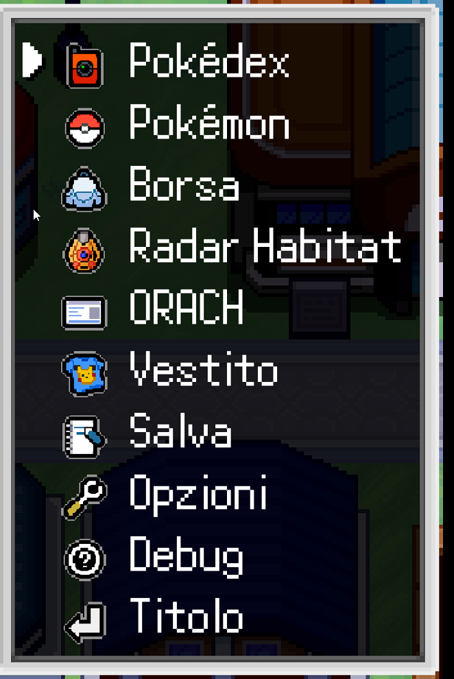
</p>

### Nuova Interfaccia Dark Glass con Ciclo Giorno / Notte

<p align="center">
  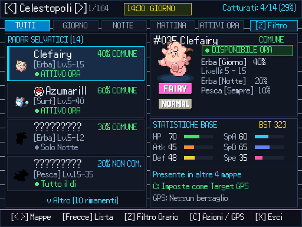
</p>

L'interfaccia è stata completamente riprogettata in stile **Dark Glass (512×384)** a tema scuro ad alto contrasto ed è suddivisa in 4 aree principali:

| Area | Descrizione |
|---|---|
| **Header (In alto)** | Mostra il nome della mappa corrente con frecce di navigazione (`◄ Mappa ►`), l'orologio interno del gioco sincronizzato con il periodo solare attivo (**`14:30 GIORNO ☀️`**, `07:15 MATTINA 🌅`, `22:00 NOTTE 🌙`) e la percentuale di cattura locale. |
| **Tab Bar Filtri (In alto)** | Premendo il tasto **`[Z]`**, puoi ciclare istantaneamente tra 5 filtri: **`TUTTI`**, **`GIORNO`**, **`NOTTE`**, **`MATTINA`** e **`ATTIVI ORA`**. La lista si aggiorna in tempo reale mostrando solo le specie corrispondenti alla fascia oraria selezionata. |
| **Lista Pokémon (A sinistra)** | Card ad alto contrasto per ogni Pokémon della zona con: icona Poké Ball (se catturato), **pallino di disponibilità colorato** (verde se reperibile adesso sul posto, grigio scuro se attivo in un'altra fascia oraria), sprite ufficiale, nome, metodo di incontro principale e livello. |
| **Pannello Dettagli (A destra)** | Battler ufficiale ad alta definizione, badge dei tipi (impilati verticalmente con stile moderno), **pillola oraria di disponibilità** (`DISPONIBILE ORA` / `SOLO NOTTE` / `SOLO GIORNO` / `SOLO MATTINA`), elenco completo di tutti i metodi di incontro della mappa (Erba, Acqua, Pesca, ecc.), e **6 statistiche base** con barre colorate proporzionali e indicatore BST totale. |

### Controlli del Radar

| Tasto | Azione |
|---|---|
| **▲ / ▼** | Scorri la lista Pokémon (tieni premuto per scorrere rapidamente) |
| **◄ / ►** | Cambia mappa (esplora qualsiasi percorso, città o grotta del gioco) |
| **Z** | **Cambia Filtro Orario** (`Tutti` → `Giorno` → `Notte` → `Mattina` → `Attivi Ora`) |
| **Invio** | Apri menù contestuale (**Imposta come Target GPS**, Mostra tutti i percorsi) |
| **C / S** | **Ricerca Globale**: cerca un Pokémon per nome per scoprire dove trovarlo nel mondo |
| **X / Esc** | Chiudi ed esci dal Radar |

### ☀️ Ciclo Giorno / Notte e Fasce Orarie

Molti Pokémon compaiono solo in determinati orari del giorno. Il Radar analizza automaticamente ogni specie e metodo di incontro:

| Fascia Oraria | Icona | Orario In-Game | Note ed Esempi |
|---|:---:|:---:|---|
| **Mattina** | 🌅 | 04:00 — 09:59 | Specie mattutine come Ledyba, Spinarak o incontri dedicati all'alba |
| **Giorno** | ☀️ | 10:00 — 19:59 | Pidgey, Oddish, Clefairy, Sunkern e specie diurne |
| **Notte** | 🌙 | 20:00 — 03:59 | Gastly, Zubat, Hoothoot, Murkrow e Pokémon notturni |
| **Sempre** | ⭐ | 24 Ore / Grotte | Pokémon delle caverne (es. Geodude, Zubat), surf e pesca |

> 💡 **Suggerimento - Filtro "Attivi Ora"**: premendo **Z** fino a selezionare *Attivi Ora*, vedrai unicamente i Pokémon che puoi catturare in questo esatto momento nella mappa in cui ti trovi, evitando di cercare a vuoto specie notturne durante il giorno!

### 🎯 Funzione GPS (Tracciamento Target)
1. Seleziona un Pokémon nella lista
2. Premi **Invio** → seleziona **"Imposta come Target GPS"**
3. Quando il Pokémon tracciato appare in un combattimento selvatico nell'erba, riceverai un **avviso acustico e visivo** immediato a inizio scontro!
4. Il Pokémon target rimarrà evidenziato con un indicatore GPS dedicato nell'header.

### 🔍 Funzione Ricerca Globale
1. Premi **C** o **S** all'interno del Radar
2. Digita il nome del Pokémon desiderato (anche solo lettere parziali, es. `Pik`)
3. Il Radar elencherà istantaneamente **tutte le mappe del gioco** dove quel Pokémon è presente, con i rispettivi metodi e percentuali di incontro ordinati dal più comune al più raro.

### 📊 Indicatori di Rarità

| Tag | Colore | Significato |
|---|---|---|
| COMUNE | Verde | Oltre 20% di probabilità di incontro |
| NON COMUNE | Giallo | 10% — 20% di probabilità |
| RARO | Arancione | 5% — 9% di probabilità |
| MOLTO RARO | Rosso | Sotto il 5% (specie molto rare) |

### 🛠️ Note tecniche e prestazioni
- **Nessun input lag**: i dati delle mappe sono memorizzati nella cache in memoria e gli sprite vengono liberati correttamente quando non più visibili.
- **Compatibile con il Randomizer**: se la modalità randomizzata è attiva, il Radar legge dinamicamente i dati generati da `Data/encounters_randomized.dat`.
- **Dati non visti**: se un Pokémon non è ancora stato registrato o visto nel Pokédex, appare come **"?????????"** con silhouette oscurata per evitare spoiler.

---

## 📖 Pokédex HTML offline

Il file **`pokedex.html`** nella cartella del gioco è un Pokédex interattivo consultabile direttamente nel browser:

<p align="center">
  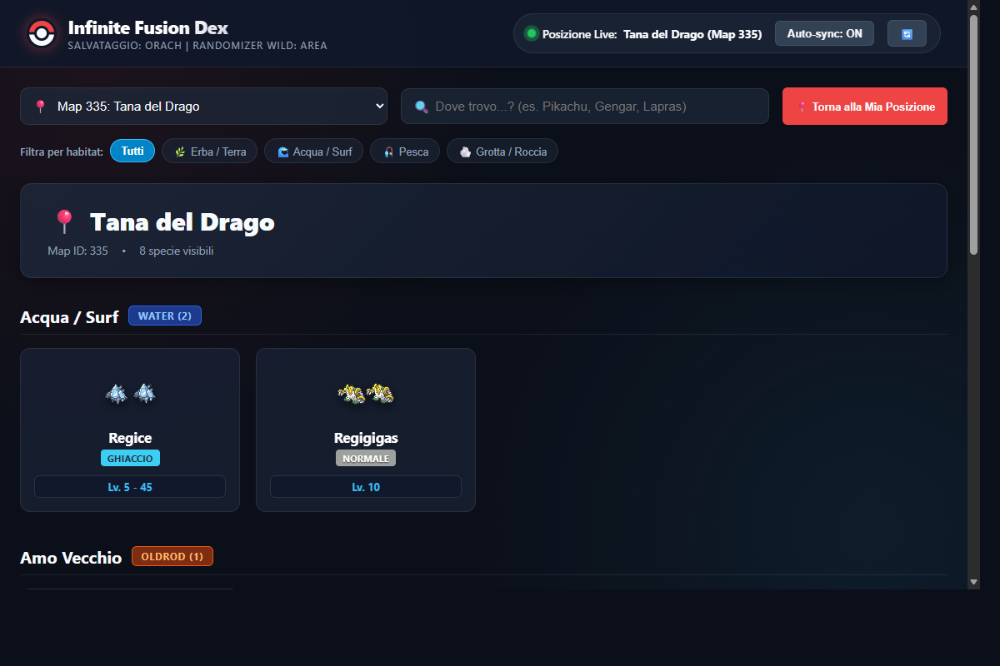
</p>

1. Fai doppio click su `pokedex.html`
2. Si aprirà nel tuo browser predefinito
3. Puoi cercare per nome, filtrare per habitat (Erba, Acqua, Pesca, Grotta), e sincronizzare la posizione in tempo reale!
4. Include tutti i **576 Pokémon base** e le loro statistiche complete.

> 💡 Funziona completamente offline, non serve connessione internet.

---

## 🎨 Remaster grafico con Magpie

[Magpie](https://github.com/Blinue/Magpie) è un motore di upscaling e post-processing in tempo reale basato su shader DirectX 11 / HLSL. In questa versione è **già integrato e preconfigurato** nella cartella `Magpie/` per sfruttare al meglio le moderne GPU (NVIDIA GeForce RTX/GTX, AMD Radeon, Intel Arc).

<p align="center">
  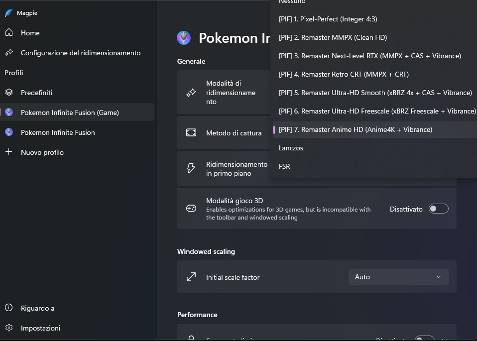
  &nbsp;
  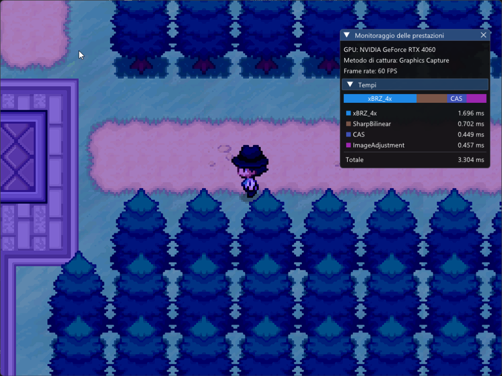
</p>

> ⚡ **Prestazioni Hardware Verificate**: L'overlay integrato di monitoraggio dimostra l'efficienza della catena di shader (`xBRZ_4x` + `SharpBilinear` + `CAS` + `ImageAdjustment`): **60 FPS granitici** con un frametime totale di appena **~3,3 millisecondi** su GPU discrete (es. NVIDIA GeForce RTX).

### 🚀 Come avviare e usare il Remaster
1. Fai doppio click su **`Avvia_Con_Remaster.bat`** (oppure avvia manualmente `Magpie/Magpie.exe` e poi `Game.exe`).
2. Il gioco si avvia **automaticamente con dimensione schermo M (1x nativo, 512×384)**, garantendo a Magpie pixel 1:1 perfetti senza sgranature interne.
3. Nella finestra del gioco, premi **`ALT + F11`** per attivare il Remaster a schermo intero.
4. Per tornare alla finestra normale in qualsiasi momento, premi nuovamente **`ALT + F11`** oppure premi **`ESC`**.

> 💡 **Nota sui tasti**: Premi **ALT + F11** per attivare Magpie con gli shader della GPU. Se premi solo *F11*, si attiva il semplice fullscreen interno di RPG Maker che si limita a stirare i pixel grezzi.

---

### 🎛️ Guida completa ai profili di upscaling

Puoi cambiare il profilo in qualsiasi momento aprendo la finestra di Magpie e selezionando la voce desiderata dal menu a tendina **Modalità di ridimensionamento** sotto il profilo **Pokemon Infinite Fusion (Game)**:

| Profilo | Effetti e Shader | Stile Grafico | Consigliato per |
|---|---|---|---|
| **`[PIF] 5. Remaster Ultra-HD Smooth`**<br>*(PREDEFINITO)* | `xBRZ 4x` + `SharpBilinear` + `CAS (Sharpening)` + `Vibrance` | **Vettoriale HD Levigato**<br>Elimina la scalettatura dei pixel; ridisegna curve, corna, archi e contorni morbidi e nitidi ad altissima definizione. | ⭐ **Consigliato per la maggior parte dei giocatori.** Ottimo su monitor 1080p, 1440p e 4K per chi vuole sprite moderni e definiti senza "pixelloni". |
| **`[PIF] 3. Remaster Next-Level RTX`** | `MMPX` + `CAS (AMD Contrast Sharpening)` + `Vibrance` | **Pixel Art Next-Gen**<br>Preserva rigorosamente i pixel quadrati duri stile retro-gaming, ma esalta a fuoco i dettagli e dona colori brillanti e vivaci. | Chi ama la Pixel Art pura stile Pokémon Gen 4/5 (DS) ma con contrasto e saturazione da monitor moderno. |
| **`[PIF] 7. Remaster Anime HD`** | `Anime4K Denoise & Upscale` + `SharpBilinear` + `Vibrance` | **Anime / Cartone Animato**<br>Utilizza algoritmi neurale-like per animazione: assottiglia le linee di contorno nere e ammorbidisce le tinte piatte. | Chi desidera un look da anime giapponese o cel-shading moderno. |
| **`[PIF] 2. Remaster MMPX (Clean HD)`** | `MMPX` + `SharpBilinear` | **Pixel Art Pulita (Neutro)**<br>Pulisce i contorni della pixel art senza filtri colore o saturazione aggiuntiva. | Monitor a bassa risoluzione o PC portatili a risparmio energetico. |
| **`[PIF] 4. Remaster Retro CRT`** | `MMPX` + `CRT Easymode` + `Vibrance` | **Televisore a Tubo Catodico (CRT)**<br>Simula scanlines, curvatura dello schermo vintage e maschera di fosfori anni '90. | Nostalgici del Game Boy Advance / SNES giocato sui vecchi televisori a tubo catodico. |
| **`[PIF] 6. Remaster Ultra-HD Freescale`** | `xBRZ Freescale` + `CAS` + `Vibrance` | **Vettoriale a Scala Continua**<br>Variante di xBRZ che adatta dinamicamente le curve a qualsiasi fattore di scala non intero. | Monitor Ultrawide (21:9 / 32:9) o configurazioni a risoluzioni particolari. |
| **`[PIF] 1. Pixel-Perfect (Integer 4:3)`** | `Pixellate (Integer Scale)` | **Purista 100% Nativo**<br>Ingrandimento a soli multipli interi esatti, con rapporto d'aspetto 4:3 intatto e barre laterali pulite. | Puristi assoluti che non vogliono alcun tipo di interpolazione o filtro. |

---

### 💡 Suggerimenti per la massima resa visiva
- **Risoluzione nativa 1x (M)**: Il gioco è programmato per avviarsi sempre su **M**. Se cambi manualmente le dimensioni dello schermo in gioco su *Full*, il motore RGSS raddoppia i pixel prima di inviarli alla GPU, riducendo l'efficacia dei filtri vettoriali xBRZ. Mantieni sempre la dimensione **M** prima di premere ALT + F11!
- **Impatto sulle prestazioni**: Tutti i profili girano a **60+ FPS fissi** anche su schede grafiche integrate recenti o GPU dedicate (NVIDIA GTX/RTX, AMD RX). Su schede RTX come la RTX 4060, l'impatto sulla GPU è inferiore all'1%.

---

## 🎲 Randomizer integrato

Il gioco include un sistema di randomizzazione degli incontri selvatici. Quando attivato dalle opzioni di gioco:
- Gli incontri selvatici vengono mescolati
- Il **Radar Habitat** si aggiorna automaticamente per mostrare i Pokémon randomizzati
- I dati del randomizer sono salvati in `Data/encounters_randomized.dat`

---

## 🐾 Incontri a vista nell'Overworld

Questa versione sblocca ed estende all'intero gioco (Kanto, Johto e Hoenn) il sistema di **Overworld Encounters**:

- **Spawn fisici sulla mappa**: I Pokémon selvatici appaiono e camminano nell'erba alta, nelle caverne e sulle superfici acquatiche con i rispettivi sprite overworld.
- **Comportamenti dinamici e IA**:
  - *Curiosi*: ti notano con un punto interrogativo `?` e si avvicinano incuriositi.
  - *Aggressivi*: ti caricano con un punto esclamativo `!` o arrabbiato.
  - *Fuggiaschi*: scappano rapidamente se provi ad avvicinarti.
  - *Statici*: rimangono fermi nel loro punto di spawn (es. bozzoli come Metapod o Kakuna).
- **Shiny cromatici a vista**: Se un Pokémon selvatico è Shiny, emette il caratteristico scintillio sonoro e visivo direttamente sulla mappa prima ancora di entrare in battaglia!
- **Effetto Repellente**: Con un Repellente attivo, i Pokémon selvatici scappano impauriti quando ti avvicini invece di iniziare la lotta.
- **Attivazione / Disattivazione facile**:
  - L'opzione è **attiva per impostazione predefinita**.
  - Puoi disattivarla o riattivarla liberamente in qualsiasi momento da:  
    `Menu di Pausa` → **Opzioni** → **Opzioni di Gioco** → **Overworld Encounters** (`On` / `Off`).

---

## 📁 Struttura del progetto

```
InfiniteFusion/
├── Game.exe                          # Eseguibile principale
├── Avvia_Con_Remaster.bat            # Launcher con Magpie
├── INSTALL_OR_UPDATE.bat             # Script di installazione/aggiornamento
├── pokedex.html                      # Pokédex HTML offline
├── README.md                         # Questo file
│
├── Data/
│   ├── Scripts/
│   │   ├── 016_UI/
│   │   │   └── 001_UI_PauseMenu.rb   # Menù pausa (con voce Radar Habitat)
│   │   ├── 052_InfiniteFusion/
│   │   │   └── Menus/
│   │   │       └── HabitatRadar.rb   # Radar Habitat (script completo)
│   │   └── 998_RandomizerList.rb     # Dati randomizer
│   ├── italian.dat                   # Dati localizzazione italiana
│   └── pokedex/dex.json              # Dati Pokédex
│
├── Magpie/                           # Magpie (upscaling grafico)
├── Graphics/                         # Sprite, tileset, UI
├── Audio/                            # Musica e effetti sonori
└── REQUIRED_BY_INSTALLER_UPDATER/    # Git portatile per l'installer
```

---

## ❓ Domande frequenti (FAQ)

### Dove sono i miei salvataggi?
I salvataggi sono in `%APPDATA%\infinitefusion` (separati dalla cartella del gioco). Aggiornare il gioco **non li cancella**.

### Posso usare i salvataggi della versione originale inglese?
**Sì**, i salvataggi sono pienamente compatibili.

### Il gioco ha lag / è lento a caricare
Prova `InfiniteFusion-performance.exe` al posto di `Game.exe`. Ha ottimizzazioni per PC meno potenti.

### Il Radar Habitat non mostra nessun Pokémon
Alcune mappe interne (edifici, grotte senza incontri) non hanno Pokémon selvatici. Usa le frecce **◄ / ►** per navigare verso un percorso o una zona con erba.

### Il Remaster non si attiva
1. Assicurati che Magpie sia in esecuzione (controlla la system tray)
2. La finestra del gioco deve essere selezionata/in primo piano
3. Premi **ALT + F11**
4. Le dimensioni schermo nel gioco devono essere **M** o **XL**, **non** "Full"

### Come aggiorno all'ultima versione?
```powershell
cd "$HOME\Desktop\InfiniteFusion"
git pull origin main
```

---

## 🙏 Crediti

- **Pokémon Infinite Fusion** — [Schrrrup](https://github.com/infinitefusion) e la community di sviluppatori
- **Versione Italiana** — [orach977](https://github.com/orach977)
- **Magpie** (upscaling) — [Blinue](https://github.com/Blinue/Magpie)
- **Essentials Engine** — Maruno e la community di Pokémon Essentials
- **Sprite** — Artisti della community di Pokémon Infinite Fusion ([credits completi](https://www.pokecommunity.com/showthread.php?t=347883))

---

## ⚖️ Disclaimer

Questo è un fan game **gratuito**. Se hai pagato per giocarci, sei stato truffato.

Questo progetto non è affiliato con Nintendo, Game Freak, Creatures Inc. o The Pokémon Company.

Pokémon e tutti i nomi correlati sono marchi registrati dei rispettivi proprietari.

---

## 🔗 Link utili

- [Wiki ufficiale](https://infinitefusion.fandom.com/)
- [Discord ufficiale](https://discord.gg/infinitefusion)
- [Reddit](https://www.reddit.com/r/PokemonInfiniteFusion/)
- [Pokécommunity](https://www.pokecommunity.com/showthread.php?t=347883)
- [Showdown](http://play.pokeathlon.com)
- [Fusion Calculator](https://www.fusiondex.org/)
- [Repository originale](https://github.com/infinitefusion/infinitefusion-e18)